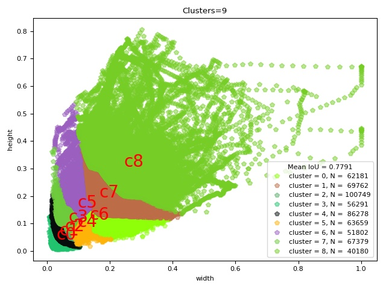

# yolov3_with_mobilenet
yolov3 using tensorflow

# How to run
## 1 make your dataset 
```
python3 convert_tfrecord.py --dataset_txt train_gt.txt --tfrecord_path_prefix ../train_data/train --basic_path ./DETRAC-train-data/Insight-MVT_Annotation_Train/
```
+ dataset_txt: filename x1 y1 x2 y2 class x1 y1 x2 y2 class
+ tfrecord_path_prefix: tfrecord file path
+ basic_path: path to data dir

## 2 get anchor file
```
python3 kmeans.py --dataset_txt train_ign.txt --anchors_txt anchors.txt --basic_path DETRAC-train-data/Insight-MVT_Annotation_Train/
``` 
+ anchors_txt: path to the output anchors
+ 
## 3 get your classname file
```
car 0
person 1
...
```

## 4 change the config.py
```
IMAGE_H, IMAGE_W = 416, 416
BATCH_SIZE       = 8
STEPS            = 25000
LR               = 0.001 # if Nan, set 0.0005, 0.0001
DECAY_STEPS      = 100
DECAY_RATE       = 0.9
SHUFFLE_SIZE     = 200
CLASSES          = utils.read_coco_names('./data/class.names')
ANCHORS          = utils.get_anchors('./data/anchors.txt', IMAGE_H, IMAGE_W)
NUM_CLASSES      = len(CLASSES)
EVAL_INTERNAL    = 100
SAVE_INTERNAL    = 500
TRAIN_TFRECORD   = "./data/train_data/train.tfrecords"
TEST_TFRECORD    = "./data/val_data/val.tfrecords"
``` 

## 5 train model
```
python3 train.py
```

## 6 test model
```
python3 test.py
```